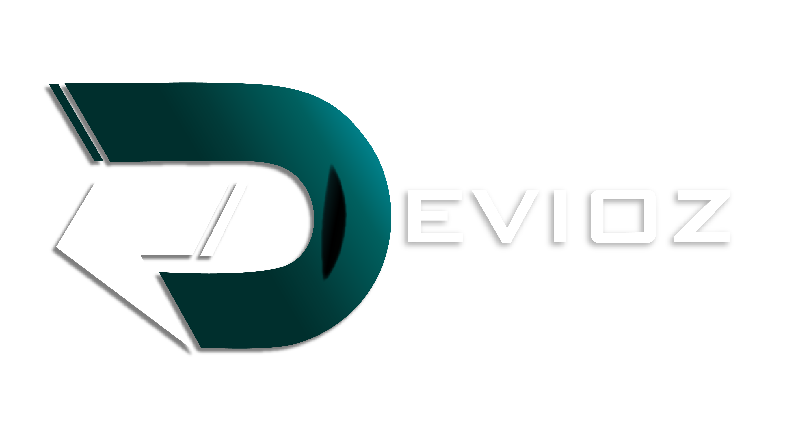

<div align="center">
  
</div>

<h1 align="center" style="font-weight: bold; font-size: 2.5rem">DEVIOZ WEB PAGE</h1>

## **Requirements** 📋
Before you get started, make sure you meet the following requirements:
```bash
Node.js
Yarn or Npm
```

## **Installation** 🔧
1. Enter the project folder
```bash
cd DEVIOZ
```

1. Install the dependencies
```bash
yarn or npm install
```

## **Deployment** 🚀
To deploy the project, execute the following command:
```bash
yarn dev or npm run dev
```

## **Built with** 🛠️
- [NextJS]([https](https://nextjs.org/)) v13.4.3 - The framework used
- [Jotai](https://jotai.pmnd.rs/) - State management
- [Axios](https://axios-http.com/) - HTTP Client
- [Tailwind](https://tailwindcss.com/) - CSS Framework
- [React Icons](https://react-icons.github.io/react-icons/) - Icons
- [React Hook Form](https://react-hook-form.com/) - Forms
- [React Toastify](https://fkhadra.github.io/react-toastify/introduction/) - Toasts


